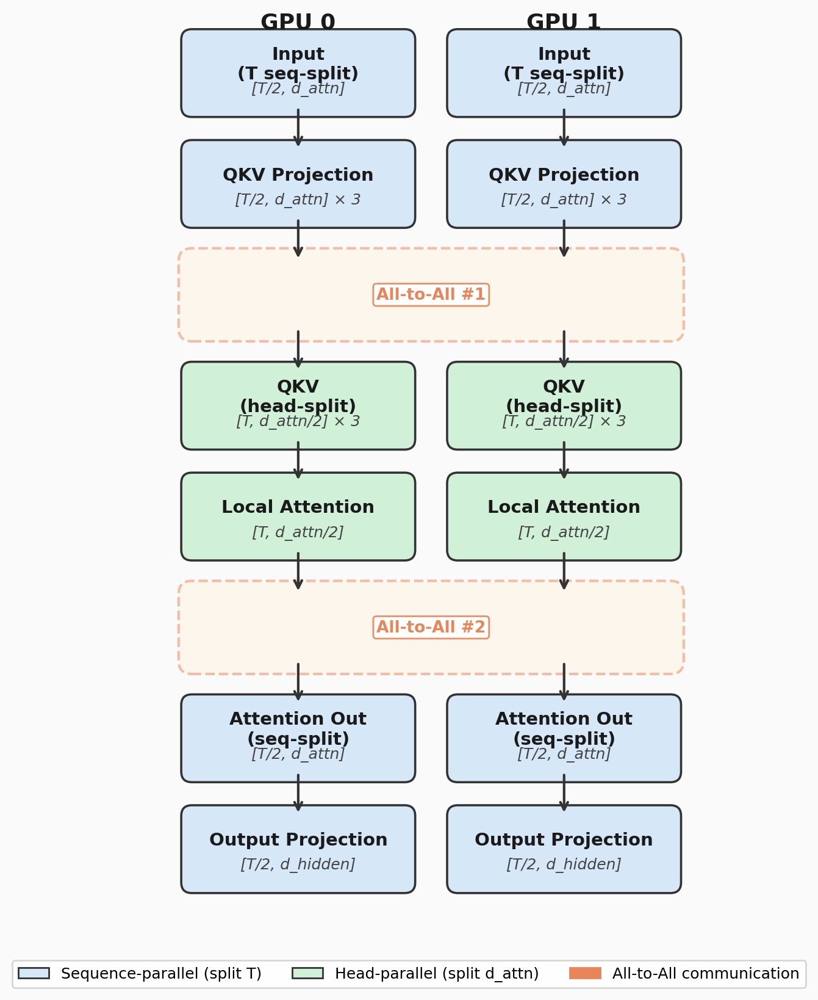

In modern parallel training methods, there are three methods that partitions tensors: Tensor Parallelism (TP), Sequence Parallelism (SP) and Context Parallelism (CP). We will introduce these parallelism in this article.

A common transformer activation tensor often looks like this:

$$
	X\in \mathbb{R}^{B\times S\times H}
$$

where $B$ is batch size, $S$ is sequence length and $H$ is hidden dimension. Different parallelism splits different dimensions. Like classic data parallelism splits batch dimension so that we can train more data simultaneously.

# Tensor Parallelism

TP splits **_model parameters or you can say hidden dimension_** across machines.

For calculations like $Y=XW$ where $W\in \mathbb{R}^{H\times 4H}$ (linear layer has 4 times hidden dimension is kind of a tradition?), if we have 4 machines in use, each machine stores only part of $W$ like $W=[W_{1},W_{2},W_{3},W_{4}]$ and each machine computes $Y_{i}=XW_{i}$ where $W_{i}\in \mathbb{R}^{H\times H}$. In the end, all results are gathered.

So TP can reduce the parameter size required on each machine but add more communication overhead, you an imagine that after each MLP or projection we need to do such gather.

# Sequence Parallelism

It splits sequence length dimension just like its name.

So instead of $X\in\mathbb{R}^{B\times S\times H}$ we have $X_{i}\in \mathbb{R}^{B\times S/P\times H}$ now, where $P$ is the number of machines. Each machine is only responsible for part of the tokens now.

Why do we have SP? This is because there are some operations that operates over sequence dimension and they don't involves parameters, so tensor parallel won't help in this case, they behave exactly the same as DP, which will store duplicate activations across all of the machines (like LayerNorm, Residual). So sequence parallelism is actually splitting activations to reduce space and compute cost (only needs to compute part of the activation too).

It splits on different axis with TP, also it splits at different time comparing with TP, So they can be used together. TP splits weight tensors and SP can do nothing with weights, it only do all-gather and reduce-scatter for sequence dim operations. And this is the main difference between CP and SP.

SP also requires synchronization. But less than TP.

# Context Parallelism

CP also splits the sequence dimension, but the purpose is different. It is designed to solve the problem with long context attention quadratic complexity. So CP is applied in attention, which involves weight tensors!

It parallels **attention context**, but attention computation needs access to all other tokens, so machines must exchange KV caches and tokens. The communication usually happens with ring communication, all-gather or P2P exchange.

## Implementation

There are different methods to implement CP.

### Ulysses

DeepSpeed Ulysses partitions sequence length dimension, suppose we have a sequence of $T$ tokens and we have 2 GPUs. Then each GPU holds hidden states for $\frac{T}{2}$ tokens. Now each GPU holds a tensor of shape $\left[ \frac{T}{2},\text{d\_embed} \right]$ (neglecting batch size here).

Then do the QKV transform so we have three tensor of shape $\left[ \frac{T}{2},\text{d\_attn} \right]$. With only half of the sequence we cannot do attention computation locally, so we **need a all to all communication here**.

After that, each machine still holds only half of the tensor but split on different dimension, which means we have QKV of shape $\left[ T, \frac{\text{d\_attn}}{2}  \right]$.

Now we can do the attention computation, softmax, mask, dropout, etc. Then matmul the result with value matrix to get half of the attention output $\left[ T, \frac{\text{d\_attn}}{2} \right]$.

Again, we want each machine to only hold half of the tensor and split on token dim, so the other **all to all communication happens here**. Each machine holds output of shape $\left[ \frac{T}{2}, \text{d\_attn} \right]$.

Matmul with projection matrix to get final hidden states $\left[ \frac{T}{2}, \text{d\_hidden} \right]$.

### Ring Attention

---

Since it is designed for attention computation, it is independent from SP, and we can apply DP + PP + SP + TP + CP together in distributed modern training.
